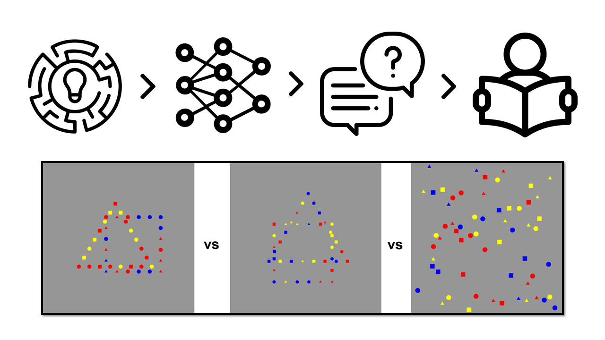

# Solving Kandinsky Patterns with human-readable explanations of neural networks

Mentor: [Hubert Baniecki](http://hbaniecki.com)

**TL;DR**: This work aims to solve a challenge from the explainable machine learning domain described in the article: H. Müller & A. Holzinger. **Kandinsky Patterns**. *Artificial Intelligence*, 300, 103546. 2021. URL: [https://doi.org/10.1016/j.artint.2021.103546](https://doi.org/10.1016/j.artint.2021.103546).

|  |
|:--:|
| Kandinsky Patterns introduce a set of challenges focusing on developing **human-understandable** explanations of machine learning predictive models. Each challenge is associated with a corresponding dataset generated from the **ground-truth** human explanation of a given abstract phenomenon. An exemplary challenge is “Objects and Shapes”, where the ground-truth defines strict relations between the patterns’ shapes and colors, while the **contradictory** and **random** patterns need to be carefully distinguished and explained. |

### Why is the project important?

Current explanations of machine learning models are far from ideal. Specifically, in computer vision, saliency maps provide little information about the model’s reasoning, while concept-based techniques may be not generally applicable. Nowadays, there are two challenges concerning research on explainability: (1) How to evaluate explanations? (2) How to make them understandable by humans—the general public, not necessarily machine learning experts? This project aims to address both by developing human-readable explanations of neural networks. The primary motivation for working with Kandinsky Patterns is the availability of the explanations’ ground truth for testing, and a high potential for comparisons with human logic. 

The project directly refers to the [HOMER (2020-2025)](https://www.mi2.ai/research-grants.html#homer-2020-2025) project conducted in our lab.

The challenges are well described in the article [Kandinsky Patterns](https://www.sciencedirect.com/science/article/pii/S0004370221000977), and the datasets are available on [GitHub](https://github.com/human-centered-ai-lab/dat-kandinsky-patterns). Moreover, there is code for generating new Kandinsky Patterns on [GitHub](https://github.com/human-centered-ai-lab/app-kandinsky-pattern-generator). 

### What shall be completed by the end of the project?

We aim to develop a framework for generating human-readable textual explanations based on a CNN model for a specific KP challenge(s). This will require:

1. Testing global explanations on this task and reporting the results: 
[https://arxiv.org/abs/1312.6034](https://arxiv.org/abs/1312.6034); [https://arxiv.org/abs/1602.03616](https://arxiv.org/abs/1602.03616).
2. Testing concept-based explanations on this task and reporting the results: [https://arxiv.org/abs/1711.11279](https://arxiv.org/abs/1711.11279); [https://arxiv.org/abs/1902.03129](https://arxiv.org/abs/1902.03129).
3. Based on the above, sketching and prototyping a new method for solving KP.
4. *(See requirements) Using GANs to improve learning a proper image representation for better results.

Of course, the methodology should be evaluated on humans in a user study, but it is **not** required to be completed during the internship (see follow-up). 

### What will the intern(s) learn during the summer project?

1. Training deep neural networks; solving image classification.
2. Working with the HPC/GPU cluster (DGX A100).
3. State-of-the-art methods for explaining deep neural networks.

### Follow-up

After the internship, it is possible to cooperate on writing down a short research article based on the experimental results. **The topic can also be later used for a diploma thesis**.

### Requirements

- Python + PyTorch 
- \+ Knowledge of convolutional neural networks (CNNs) & deep neural networks in general.
- \++ Knowledge of neural network explanations and/or generative adversarial networks (GANs) is a big plus.

### Attribution
The attached image has been designed using resources from [https://www.flaticon.com](https://www.flaticon.com/).